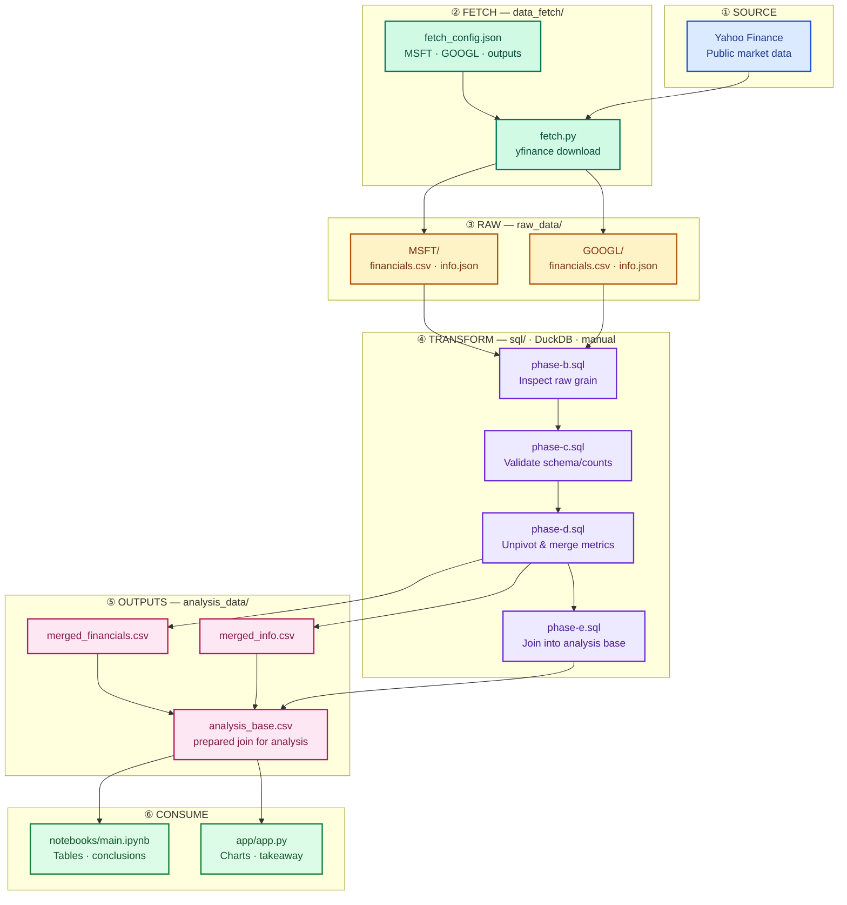

# AI valuation EDA

Exploratory analysis of whether **Microsoft or Google** looks more reasonably valued relative to reported revenue and profitability — using **only public financial data** (Yahoo Finance via `yfinance`).

✨ **Live Dashboard:** [https://ai-valuation-eda.streamlit.app/](https://ai-valuation-eda.streamlit.app/)

## Business question
Which AI-exposed megacap looks more reasonably valued relative to revenue and profitability: Microsoft or Google?

## Presentation Overview

*   **The Goal**: A modular data pipeline to analyze whether Microsoft or Google is more reasonably valued relative to revenue and profitability.
*   **The Data**: Retrieved directly from public Yahoo Finance disclosures via the `yfinance` library.
*   **The Insight**: While Google leads in sheer scale, the data shows Microsoft is currently more efficient and "cheaper" relative to its earnings.
*   **The Tech Stack**: Built with **Python**, **DuckDB** (for high-performance SQL transformations), and **Streamlit** (for the interactive dashboard).
*   **The Live Demo**: I will now launch the dashboard and **trigger the pipeline live** to show the real-time logs as we fetch, unpivot, and join the data.

## Quick Run (All-in-One Command)

Ensure you have Python 3, pip, and Git installed.

macOS & Linux (Terminal):
```bash
python3 --version && python3 -m pip --version && git --version
```

Windows (PowerShell):
```powershell
python --version; python -m pip --version; git --version
```

If any tool is missing, download it from python.org or git-scm.com. If you do not have Git, you can instead download the project as a ZIP file from GitHub, extract it to your Desktop, and open your terminal in that folder.


Copy and paste the command for your system to navigate to your Desktop, clone the repository, set up a virtual environment, install dependencies, and run the pipeline and Streamlit dashboard:

macOS & Linux (Terminal):
```bash
cd ~/Desktop && git clone https://github.com/mimferpo/ai-valuation-eda.git && cd ai-valuation-eda && python3 -m venv .venv && source .venv/bin/activate && python -m pip install -r requirements.txt && python run_pipeline.py
```

Windows (PowerShell):
```powershell
cd ~\Desktop; git clone https://github.com/mimferpo/ai-valuation-eda.git; cd ai-valuation-eda; python -m venv .venv; .venv\Scripts\Activate.ps1; python -m pip install -r requirements.txt; python run_pipeline.py
```
## Project Dataflow

End-to-end map: data pipeline, project phases, outputs, and how to refresh.



## Project structure

```text
ai-valuation-eda/
├── data_fetch/          # Yahoo Finance fetch config and pull script
│   ├── fetch_config.json
│   ├── fetch.py
│   └── README.md
├── raw_data/            # raw downloaded files, replaced by fetch.py
│   ├── MSFT/
│   └── GOOGL/
├── sql/                 # manual DuckDB SQL phases B–E
│   ├── phase-b.sql      # inspect raw grain
│   ├── phase-c.sql      # validate schema/counts
│   ├── phase-d.sql      # unpivot & merge metrics
│   ├── phase-e.sql      # join into analysis base
│   └── README.md
├── analysis_data/       # generated CSVs for notebook and dashboard
│   ├── merged_financials.csv
│   ├── merged_info.csv
│   └── analysis_base.csv
├── notebooks/
│   └── main.ipynb       # table-based analysis and conclusions
├── app/
│   ├── app.py           # Streamlit dashboard
│   └── README.md
├── docs/                # presentation slide hosted on GitHub Pages
│   ├── index.html       # interactive slide webpage
│   └── qr-code.png      # QR code to professional site
├── project_requirements/  # phase guides A–K
├── requirements.txt     # project Python dependencies
├── pyrightconfig.json   # configuration for Python type checker
├── run_pipeline.py      # all-in-one script to run fetch, SQL, and Streamlit
└── README.md            # project documentation and runbook
```

## Separation of Concerns

| Section | Responsibility |
|---------|----------------|
| `data_fetch/` | Defines and runs the Yahoo Finance pull. Edit `fetch_config.json`, then run `fetch.py`. |
| `raw_data/` | Stores raw downloaded files exactly as fetched per company. Replaced every time `fetch.py` runs. |
| `sql/` | Holds manual SQL phase queries for inspecting grain, auditing quality, unpivoting/merging metrics, and exporting the joined analysis base. |
| `analysis_data/` | Stores generated Phase D CSVs plus the Phase E analysis base for the notebook and dashboard. |
| `notebooks/` | Table-based EDA, comparison logic, and written conclusions. |
| `app/` | Streamlit dashboard that visualizes the main findings. |
| `project_requirements/` | Documents the A–K project phases and what each phase is expected to complete. |

## Development Philosophy: Applying the UMPIRE Method

This `ai-valuation-eda` project was developed following the **UMPIRE method**, a structured problem-solving framework that guided my approach to its design and implementation, ensuring clarity and robust solutions.

Each step was applied as follows:

*   **U**nderstand: Clearly defined project requirements and desired outcomes.
*   **M**atch: Selected appropriate tools and techniques (e.g., Python, SQL, Streamlit).
*   **P**lan: Outlined solutions and architectural steps before coding.
*   **I**mplement: Wrote clean, modular code for data processing and visualization.
*   **R**eview: Rigorously tested functionality and debugged iteratively.
*   **E**valuate: Assessed performance, trade-offs, and optimized solutions.

This systematic application ensured thoughtful conception and rigorous implementation of all project components.

## Setup Environment

**Option A — Conda (if you use Anaconda)**

```bash
conda create -n ai-valuation-eda python=3.12 -y
conda activate ai-valuation-eda
python -m pip install -r requirements.txt
```

**Option B — venv (if no conda)**

```bash
python3.12 -m venv .venv
source .venv/bin/activate          # Windows: .venv\Scripts\activate
python -m pip install -r requirements.txt
```

## Data Transformation & Analysis Logic

*   **Audit**: Validates raw data schema and integrity (Phases B & C).
*   **Transform**: Unpivots wide financials into a relational "long" format (Phase D).
*   **Join**: Merges valuation snapshots with historical metrics into one analysis base (Phase E).
*   **Analyze**: Filters KPIs, calculates YoY growth, and powers the Strategy Engine.
*   **Dashboard**: Displays interactive charts and live pipeline logs.

Read [`app/README.md`](app/README.md) for refresh steps and view descriptions.

## Tech stack

*   **Languages:** Python
*   **Data & Analysis:** SQL, Pandas, NumPy, yfinance, DuckDB
*   **Visualizations:** Streamlit, Plotly, Mermaid
*   **Workflow:** Ingestion → SQL Transform → Table Analysis → Dashboard
*   **Tools:** Git, Conda, VS Code, Jupyter


## Special Thanks

A heartfelt thank you to **Madrid for Refugees** and **all the dedicated teachers** for their invaluable support and guidance throughout this journey.


## Acknowledgments

- Data sourced from Yahoo Finance via the yfinance Python library.
- Financial metrics (revenue, profitability, market cap) retrieved directly from public company disclosures.
- SQL transformations executed using DuckDB for data cleaning, merging, and preparation.
- Data analysis and table-based EDA performed with Pandas in Jupyter notebooks.
- Visualizations and interactive dashboard built with Streamlit.
- Valuation comparison conducted using trailing financial multiples and current market data.
- Project structured as a modular data pipeline: fetch → transform → analyze → visualize.
- Analysis limited to historical and snapshot-based metrics; does not include forward guidance or analyst consensus.
- No machine learning models, predictive analysis, or proprietary methodologies applied.
- Conclusions are hypotheses based on facts and retrieved data; not definitive investment recommendations.

## About the Author
Authored by [Michael P.](https://mimferpo.github.io/ai-valuation-eda/) Hybrid ITSM + Automation Expert for EMEA-based SaaS